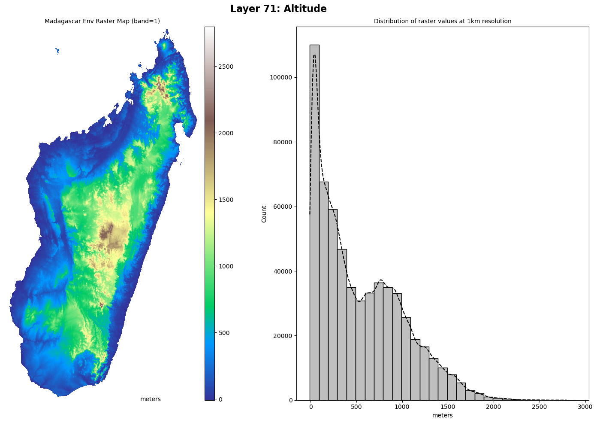

========================
Overview
========================

.. image:: https://img.shields.io/github/languages/top/tahiri-lab/py_madaclim?logoColor=blue
   :alt: GitHub top language
   :target: https://github.com/tahiri-lab/py_madaclim

.. image:: https://img.shields.io/github/contributors/tahiri-lab/py_madaclim?color=orange&logo=github
   :alt: GitHub contributors
   :target: https://github.com/tahiri-lab/py_madaclim

.. image:: https://img.shields.io/github/last-commit/tahiri-lab/py_madaclim?color=purple&logo=github
   :alt: GitHub last commit
   :target: https://github.com/tahiri-lab/py_madaclim

.. image:: https://img.shields.io/website/https/tahirinadia.github.io.svg
   :alt: Website status
   :target: https://tahirinadia.github.io

.. contents:: Table of Contents
   :depth: 2

Package Description
-------------------

.. image:: ../example/example_coll_plot.png
   :alt: Example of a MadaclimCollection plot with layer 79
   :align: center

`py-madaclim` is a Python 3+ package that facilitates interaction with the `Madaclim db`_, an open-source climate and environmental database for Madagascar. 

It provides functionalities to fetch and explore raster-based data with metadata information support, create new datasets from existent spreadsheets/csv/dataframes from any Coordinate Reference System (CRS), and to explore/manipulate data with visualization and transformation tools.

.. _Madaclim db: https://madaclim.cirad.fr/

Installation
------------
`py-madaclim` works with Python 3.10 and 3.11. For now, we offer two setup options:

- Using `pip` and `venv` for Python=3.10.
- Using `Conda`_ for Python=3.11.

The requirements for each setup can be found in `conda_requirements.txt`_ and `venv_requirements.txt`_.

.. _Conda: https://conda.io
.. _conda_requirements.txt: https://github.com/tahiri-lab/coffeaPhyloGeo/blob/main/conda_requirements.txt
.. _venv_requirements.txt: https://github.com/tahiri-lab/coffeaPhyloGeo/blob/main/venv_requirements.txt

**Linux/Debian systems**

Steps for ``pip`` installation (Recommended)

#. Clone the repo and create a new venv:

   .. code-block:: bash

      git clone https://github.com/tahiri-lab/py_madaclim.git
      cd py_madaclim
      python -m venv ~/.pyenv/py_mada_env    #python=3.10
      source ~/.pyenv/py_mada_env/bin/activate

#. Activate the environment and install the requirements:

   .. code-block:: bash

      pip install -r venv_requirements.txt    # reqs before py_madaclim
      pip install .    # to install py-madaclim

Steps for ``conda`` installation (Slow environment creation)

#. First follow these `instructions <https://docs.conda.io/projects/conda/en/latest/user-guide/install/linux.html>`_ to install conda on your machine.
#. Clone the repo and configure the ``conda-forge`` channel:

   .. code-block:: bash

      git clone https://github.com/tahiri-lab/py_madaclim.git
      cd py_madaclim

      # Configure correct channel priority in ~/.condarc
      conda config --add channels conda-forge && conda config --append channels plotly
      conda config --show channels
      # channels:
      #   - conda-forge
      #   - defaults
      #   - plotly

#. Create the environment with dependencies (This is the slow step, patience!):

   .. code-block:: bash

      conda create -n py_mada_env --file conda_requirements.txt

#. Activate the environment and install ``py-madaclim``:

   .. code-block:: bash

      conda activate py_mada_env
      pip install .    # using pip inside conda env

Getting Started
------------------------

**Madaclim db metadata with the** ``info`` **module**

Basic metada and download rasters from Madaclim server

.. code-block:: python

   >>> # Get available methods and properties for MadaclimLayers
   >>> from py_madaclim.info import MadaclimLayers
   >>> mada_info = MadaclimLayers()
   >>> print(mada_info)
   MadaclimLayers(
      all_layers = DataFrame(79 rows x 6 columns)
      categorical_layers = DataFrame(Layers 75, 76, 77, 78 with a total of 79 categories
      public methods -> download_data, fetch_specific_layers, get_categorical_combinations
                  get_layers_labels, select_geoclim_type_layers
   )

   >>> # To access all layers as a dataframe
   >>> mada_info.all_layers
   geoclim_type  layer_number layer_name                       layer_description  is_categorical    units
   0         clim             1      tmin1   Monthly minimum temperature - January           False  °C x 10
   ...

   >>> # Built-in method to download the Madaclim raster files
   >>> mada_info.download_data(save_dir=cwd)

Get detailed labels for each raster layers

.. code-block:: python

   >>> env_labels = mada_info.get_layers_labels(
   ... layers_subset="env", 
   ... as_descriptive_labels=True
   ... )
   >>> print(env_labels[0])
   'env_71_alt_Altitude (meters)'

**Explore the rasters and create datasets with the** ``raster_manipulation`` **module**

``MadaclimRasters`` basic properties and visualization methods

.. code-block:: python

   >>> from py_madaclim.raster_manipulation import MadaclimRasters

   >>> mada_rasters = MadaclimRasters("madaclim_current.tif", "madaclim_enviro.tif")
   >>> print(mada_rasters)
   MadaclimRasters(
      clim_raster = madaclim_current.tif,
      clim_crs = epsg:32738,
      clim_nodata_val = -32768.0
      env_raster = madaclim_enviro.tif,
      env_crs = epsg:32738,
      env_nodata_val = -32768.0
   )

   # Basic visualization for a continuous data layer
   >>> mada_rasters.plot_layer(
   ...     layer=env_labels[0], 
   ...     imshow_cmap="terrain", 
   ...     histplot_binwidth=100, histplot_stat="count", 
   ... )

**Create sample points with** ``MadaclimPoint`` **and** ``MadaclimCollection``

.. code-block:: python

   >>> from py_madaclim.raster_manipulation import MadaclimPoint

   # Single point
   >>> specimen_1 = MadaclimPoint(specimen_id="abbayesii", longitude=46.8624, latitude=-24.7541)

   # Multipoints
   >>> coll = MadaclimCollection.populate_from_csv("collection_example.csv")
   >>> print(coll[0])
   MadaclimPoint(
      specimen_id = ABA,
      source_crs = 4326,
      longitude = 46.8624,
      latitude = -24.7541,
      mada_geom_point = POINT (688328.2403248843 7260998.022932809),
      sampled_layers = None (Not sampled yet),
      nodata_layers = None (Not sampled yet),
      is_categorical_encoded = False,
      Species = C.abbayesii,
      Botanical_series = Millotii,
      Genome_size_2C_pg = 1.25,
      gdf.shape = (1, 11)
   )

**Sample the rasters, visualize and encode the data for ML-related tasks**

.. code-block:: python

   # Sample the collection reflects the changes to the geodataframe
   >>> coll.sample_from_rasters(
   ...     clim_raster=mada_rasters.clim_raster,
   ...     env_raster=mada_rasters.env_raster,
   ...     layers_to_sample="all",   # Or any single/list of layers labels
   ...     layer_info=True
   ... )
   >>> coll.gdf["specimen_id", env_labels[-1]]

.. list-table::
   :widths: 20 40
   :header-rows: 1

   * - specimen_id
     - Percentage of forest cover in 1 km by 1 km grid cells (%)
   * - ABA
     - 100
   * - AMB
     - 65
   * - ANK1
     - 20
   * - BISS
     - 89
   * - COS
     - 0
   * - VOHE
     - 88

.. code-block:: python
   
   # Visualize on the raster map
   >>> coll.plot_on_layer(env_labels[-1], imshow_cmap="coolwarm")

.. image:: ../example/rastplot_2.png
   :alt: Collection plot example
   :width: 500

Binary encoding for downstream ML applications

.. code-block:: python

   # Binary encoding for ML-tasks
   >>> coll.binary_encode_categorical()
   >>> print(coll.is_categorical_encoded)
   True
   >>> coll_categ_layers = set(["_".join(label.split("_")[:4]) for label in coll.encoded_categ_labels])
   >>> print(f"Splitted {len(coll_categ_layers)} layers into {len(coll.encoded_categ_labels)} unique categories")
   Splitted 4 layers into 83 unique categories

   # Updated geodataframe attribute
   >>> env_76_encoded = coll.encoded_categ_labels[12:30]
   >>> coll.gdf[["specimen_id"] + env_76_encoded]

.. list-table::
   :widths: 10 10 10 10 10 10 10 10 10 10 10 10 10 10 10 10 10 10 10
   :header-rows: 1

   * - specimen_id
     - env_76_soi_Soil types_Alluvio-colluvial_Deposited_Soils
     - env_76_soi_Soil types_Andosols
     - env_76_soi_Soil types_Bare_Rocks
     - env_76_soi_Soil types_Fluvio-marine_Deposited_Soils_-_Mangroves
     - env_76_soi_Soil types_Highly_Rejuvenated,_Penevoluted_Ferralitic_Soils
     - env_76_soi_Soil types_Humic_Ferralitic_Soils
     - env_76_soi_Soil types_Humic_Rejuvenated_Ferralitic_Soils
     - env_76_soi_Soil types_Hydromorphic_Soils
     - env_76_soi_Soil types_Indurated-Concretion_Ferralitic_Soils
     - env_76_soi_Soil types_Podzolic_Soils_and_Podzols
     - env_76_soi_Soil types_Poorly_Evolved_Erosion_Soils,_Lithosols
     - env_76_soi_Soil types_Raw_Lithic_Mineral_Soils
     - env_76_soi_Soil types_Red_Ferruginous_Soils
     - env_76_soi_Soil types_Red_Fersiallitic_Soils
     - env_76_soi_Soil types_Rejuvenated_Ferralitic_Soils_with_Degrading_Structure
     - env_76_soi_Soil types_Rejuvenated_Ferralitic_Soils_with_Little_Degrading_Structure
     - env_76_soi_Soil types_Salty_Deposited_Soils
     - env_76_soi_Soil types_Skeletal_Shallow_Eroded_Ferruginous_Soils
   * - ABA
     - 0
     - 1
     - 0
     - 0
     - 0
     - 0
     - 0
     - 0
     - 0
     - 0
     - 0
     - 0
     - 0
     - 0
     - 0
     - 0
     - 0
     - 0
   * - AMB
     - 0
     - 0
     - 0
     - 0
     - 0
     - 0
     - 0
     - 1
     - 0
     - 0
     - 0
     - 0
     - 0
     - 0
     - 0
     - 0
     - 0
     - 0
   * - ANK1
     - 0
     - 0
     - 0
     - 0
     - 1
     - 0
     - 0
     - 0
     - 0
     - 0
     - 0
     - 0
     - 0
     - 0
     - 0
     - 0
     - 0
     - 0
   * - BISS
     - 0
     - 0
     - 0
     - 0
     - 0
     - 0
     - 0
     - 0
     - 0
     - 0
     - 0
     - 0
     - 0
     - 0
     - 0
     - 0
     - 0
     - 1
   * - COS
     - 0
     - 0
     - 0
     - 1
     - 0
     - 0
     - 0
     - 0
     - 0
     - 0
     - 0
     - 0
     - 0
     - 0
     - 0
     - 0
     - 0
     - 0
   * - VOHE
     - 0
     - 1
     - 0
     - 0
     - 0
     - 0
     - 0
     - 0
     - 0
     - 0
     - 0
     - 0
     - 0
     - 0
     - 0
     - 0
     - 0
     - 0

**GBIF API utilities for pre-data fetching in the** ``utils`` **module**

Request an occurence search and download the data

.. code-block:: python

   >>> from py_madaclim.utils import gbif_api

   # Get taxonKey of interest
   >>> coffea_key = gbif_api.get_taxon_key_by_species_match("coffea")
   EXACT match type found with 95% confidence!
   canonical name of match: Coffea
   GBIF_taxon_key: 2895315

   # Search occurrences
   >>> recent_years = (2010, 2023)
   >>> coffea_search_results_2010_present = gbif_api.search_occ_mdg_valid_coordinates(taxon_key=coffea_key, year_range=recent_years)
   Fetching all 613 occurrences in year range 2010-2023...
   Extracting occurrences 0 to 300...
   Extracting occurrences 300 to 600...
   Extracting occurrences 600 to 613...
   Total records retrieved: 613

   # ...Or create a download for a given search
   >>> from dotenv import load_dotenv
   >>> import os
   >>> load_dotenv(".env")
   True
   >>> download_id = gbif_api.request_occ_download_mdg_valid_coordinates(taxon_key=coffea_key, email=your_email@gmail.com, year_range=recent_years)

   # Download, extract and read as df
   >>> coffea_gbif_df = gbif_api.download_extract_read_occ(download_id=download_id, target_dir="gbif_example")
   Response OK from https://api.gbif.org/v1/occurrence/download for the given 'download_id'
   Progress for download_0008397-230810091245214.zip : 100.0% completed of 0.21 MB downloaded [average speed of 0.41 MB/s]
   Extracting all 17 files to target location: .../download_0008397-230810091245214/
   Read and saved core data into pandas df: occurrence.txt

**Create a MadaclimCollection from the GBIF occurrences**

.. code-block:: python

   # Keep relevant data
   df = coffea_gbif_df.loc[coffea_gbif_df["taxonRank"] == "SPECIES"]
   df = df.loc[:, ["verbatimScientificName", "decimalLongitude", "decimalLatitude", "year"]]
   df = df.reset_index().drop(columns="index")
   df["specimen_id"] = df.apply(lambda row: f"{row['verbatimScientificName']}_{row.name}", axis=1)
   df["specimen_id"] = df["specimen_id"].str.strip("Coffea ")
   # Format for MadaclimCollection constructor
   df.columns = ["genus_species", "longitude", "latitude", "year", "specimen_id"]
   df.head()

.. list-table::
   :widths: 30 15 15 10 30
   :header-rows: 1

   * - genus_species
     - longitude
     - latitude
     - year
     - specimen_id
   * - Coffea perrieri
     - 46.015693
     - -17.117573
     - 2023
     - perrieri_0
   * - Coffea pervilleana
     - 45.920397
     - -17.077081
     - 2023
     - pervilleana_1
   * - Coffea pervilleana
     - 45.923007
     - -17.078820
     - 2023
     - pervilleana_2
   * - Coffea boiviniana (Baill.) Drake
     - 49.353747
     - -12.336711
     - 2020
     - boiviniana (Baill.) Drake_3
   * - Coffea humbertii J.-F.Leroy
     - 44.690055
     - -22.888583
     - 2018
     - humbertii J.-F.Leroy_4

Full walkthrough example
------------------------

For a full walkthrough, follow along this `notebook <https://nbviewer.org/github/tahiri-lab/py_madaclim/blob/main/example/full_walkthrough.ipynb>`_

References
----------

- `Madaclim`_ @ CIRAD
- `Tahiri lab`_ @ Université de Sherbrooke

.. _Madaclim: https://madaclim.cirad.fr
.. _Tahiri lab: https://madaclim.cirad

py-madaclim API Documentation
-----------------------------

Explore detailed documentation for all `py-madaclim` modules and their respective functionalities.

- :doc:`Access the py-madaclim API Documentation <modules>`
