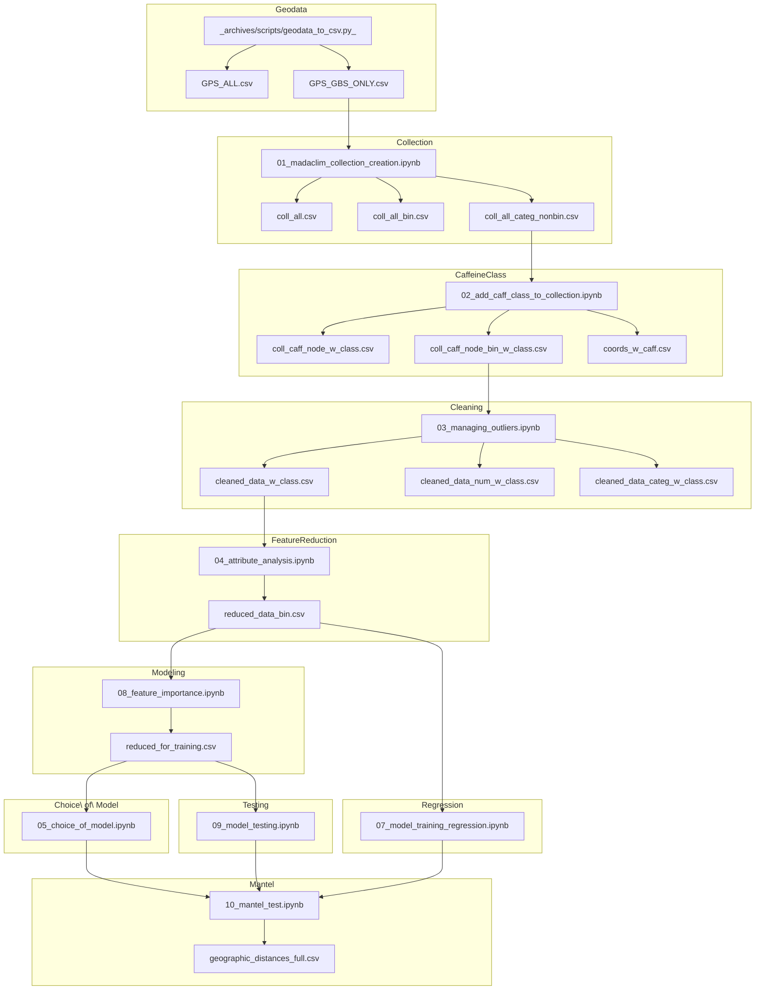

```mermaid
flowchart TB
  %% Stage 1: Geospatial Data Prep
  subgraph Geodata
    direction TB
    GEC["_archives/scripts/geodata_to_csv.py_"]
    GPS_ALL["GPS_ALL.csv"]
    GPS_GBS["GPS_GBS_ONLY.csv"]
    GEC --> GPS_ALL
    GEC --> GPS_GBS
  end

  %% connect to next stage
  GPS_GBS --> C1

  %% Stage 2: Collection Creation
  subgraph Collection
    direction TB
    C1["01_madaclim_collection_creation.ipynb"]
    COLL_ALL["coll_all.csv"]
    COLL_BIN["coll_all_bin.csv"]
    COLL_CAT["coll_all_categ_nonbin.csv"]
    C1 --> COLL_ALL
    C1 --> COLL_BIN
    C1 --> COLL_CAT
  end

  COLL_CAT --> C2

  %% Stage 3: Add Caffeine Class
  subgraph CaffeineClass
    direction TB
    C2["02_add_caff_class_to_collection.ipynb"]
    CCLASS["coll_caff_node_w_class.csv"]
    CCLASS_BIN["coll_caff_node_bin_w_class.csv"]
    COORDS["coords_w_caff.csv"]
    C2 --> CCLASS
    C2 --> CCLASS_BIN
    C2 --> COORDS
  end

  CCLASS_BIN --> MOUT

  %% Stage 4: Outlier Cleaning
  subgraph Cleaning
    direction TB
    MOUT["03_managing_outliers.ipynb"]
    CLEAN["cleaned_data_w_class.csv"]
    CLEAN_NUM["cleaned_data_num_w_class.csv"]
    CLEAN_CAT["cleaned_data_categ_w_class.csv"]
    MOUT --> CLEAN
    MOUT --> CLEAN_NUM
    MOUT --> CLEAN_CAT
  end

  CLEAN --> ATTR

  %% Stage 5: Feature Reduction
  subgraph FeatureReduction
    direction TB
    ATTR["04_attribute_analysis.ipynb"]
    RED_BIN["reduced_data_bin.csv"]
    ATTR --> RED_BIN
  end

  RED_BIN --> FI

  %% Stage 6: Feature Importance & Training Prep
  subgraph Modeling
    direction TB
    FI["08_feature_importance.ipynb"]
    TRAIN["reduced_for_training.csv"]
    FI --> TRAIN
  end

  TRAIN --> CHM
  RED_BIN --> MREG
  TRAIN --> MTEST

  subgraph Choice\ of\ Model
    direction TB
    CHM["05_choice_of_model.ipynb"]
  end

  subgraph Regression
    direction TB
    MREG["07_model_training_regression.ipynb"]
  end

  subgraph Testing
    direction TB
    MTEST["09_model_testing.ipynb"]
  end

  CHM --> MNTL
  MREG --> MNTL
  MTEST --> MNTL

  %% Stage 7: Mantel Test
  subgraph Mantel
    direction TB
    MNTL["10_mantel_test.ipynb"]
    GEO_DIST["geographic_distances_full.csv"]
    MNTL --> GEO_DIST
  end

```